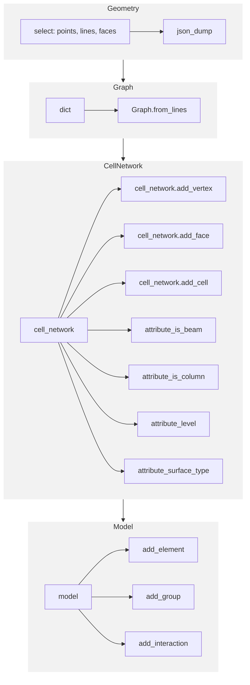

# compas_grid

Model of simple grid structures for multi-storey buildings.

## Workflow

[https://mermaid.live/edit#pako:eNqVVE1rGzEQ_StCIbd1MPFtDYV8QE_txb3VZZGlkVeNvpBGcZeQ_15J9trrEIOzhvXozbw3Gmlm3yh3AmhLpXY73rOA5Nfj2hJye0ueQSoLhKeIzhCuWYwQi6-a2UsESJY0rnDQQKTSup3P503E4F6gvVksFgd7tlMC-_be_1ue8WPabAPz_UTgRt6X32WReRUpMiObfAdnAMNQwPKsQANH5ezvWK2WeKcsxoboXFD-k4xD_ENms2_kb3S2E8n4ujOw4qN2eY_CQnGsrIreyeBMVyVPZELO6E-g9U_AnQsvowjPUGf3WBWbAndMiO4VAsL-qK4jlHq-EF6Ay-EMMahNQuhU7DbAzJWh3Olk7DXBGl7hqg3EFEppHQ4eLtzPj9y-epQyZbHXyGXmuzdgcfm5dxtc8hd8uVkgsNpCH2_2NBcBNCsRsVe-jsXYhqcOqeRqVWzSDNUzWVd_rWU5yfTgvR6Otc6iB66k4iSWeYlESWIBBIjjUB330NSszSRDU9XPRy7nog01EAxTIn8E3mpuin0-uDVts3mY8DVd2_ccyhK61WA5bTEkaGg-w21PW8l0zKvkBUN4VixnMAf0_T-ZG35x]](https://mermaid.live)




## Commit style

```bash
git commit -m "ADD <description>"         <--- for adding new elements
git commit -m "FIX <description>"         <--- for fixing (errors, typos)
git commit -m "FLASH <description>"       <--- quick checkpoint before refactoring
git commit -m "MILESTONE <description>"   <--- for capping moment in development
git commit -m "CAP <description>"         <--- for for less important milestones
git commit -m "UPDATE <description>"      <--- for moddification to the same file
git commit -m "MISC <description>"        <--- for any other reasons to be described
git commit -m "WIP <description>"         <--- for not finished work
git commit -m "REFACTOR <description>"    <--- for refactored code
git commit -m "MERGE <description>"       <--- for merging operations
git commit -m "WIP-CAP <description>"     <--- for when combining multiple commits into one
```

## Installation

Stable releases can be installed from PyPI.

```bash
pip install compas_grid
```

To install the latest version for development, do:

```bash
git clone https://github.com//compas_grid.git
cd compas_grid
pip install -e ".[dev]"
```

## Documentation

For further "getting started" instructions, a tutorial, examples, and an API reference,
please check out the online documentation here: [compas_grid docs](https://.github.io/compas_grid)

## Issue Tracker

If you find a bug or if you have a problem with running the code, please file an issue on the [Issue Tracker](https://github.com//compas_grid/issues).

